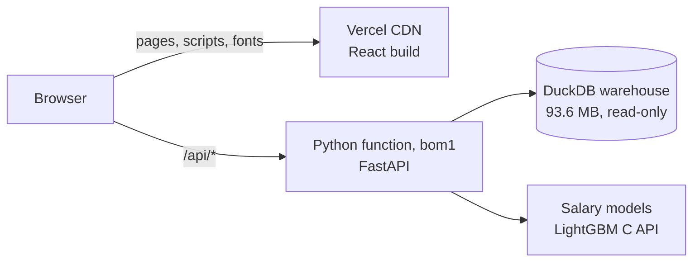

# StackScope

**Technology market intelligence from 664,042 developer survey responses (2017–2025).**

[](https://github.com/garvbahl37-gif/stackscope/actions/workflows/ci.yml)
[](https://stackscope-analytics.vercel.app)


**Live dashboard:** https://stackscope-analytics.vercel.app<br>
**API documentation:** https://stackscope-analytics.vercel.app/api/docs

StackScope turns nine inconsistent annual releases of the Stack Overflow Developer Survey into one reproducible analytics
warehouse, then reads it the way an industry analyst would. It shows which technologies lead and which are losing
momentum, where developers are migrating, what skills are worth after controlling for everything else, and how far to
trust each number. The warehouse is DuckDB (a star schema), the analytics are Python, the API is FastAPI and the dashboard
is React with ECharts. Everything, from the raw download to the Excel pack, rebuilds with one command.


> Independent portfolio project. Not affiliated with Gartner or Stack Overflow. "Magic Quadrant" is a Gartner trademark;
> the quadrant here is an original, data-driven method that only borrows the idea of a two-axis market view.

## Contents

- [Try it in five minutes](#try-it-in-five-minutes)
- [What the data says](#what-the-data-says)
- [What's inside](#whats-inside)
- [Skills demonstrated](#skills-demonstrated)
- [Architecture](#architecture)
- [Deployment](#deployment)
- [API](#api)
- [Run it locally](#run-it-locally)
- [Pipeline stages](#pipeline-stages)
- [Deliverables](#deliverables)
- [Testing and quality](#testing-and-quality)
- [Project structure](#project-structure)
- [Tech stack](#tech-stack)
- [Limitations](#limitations)
- [Data and licences](#data-and-licences)

## Try it in five minutes

A suggested path through the [live dashboard](https://stackscope-analytics.vercel.app):

1. **Overview.** Press play on the quadrant to watch nine years of market movement, then switch between languages,
   databases, cloud platforms and web frameworks.
2. **Retention & churn.** The churn-flow diagram shows where each technology's leavers want to go: 52% of Java users
   don't want to keep using it, and Rust is their first choice.
3. **Pay & skills.** Skill premiums are estimated after controlling for country, experience, role, company size,
   education and industry. AWS, the largest premium among widely used skills, is worth +6.8%, against a raw gap of +27%.
4. **Salary estimator.** Change the country or add a technology. The estimate comes back as a calibrated P10–P90 range
   with an explanation of what drives it.
5. **Data quality.** Browse the 29 automated checks behind every number, and see 92 of Stack Overflow's own published
   figures reproduced within half a percentage point.
6. **SQL lab.** Run one of the ten showcase queries, or write your own, against the full warehouse in a read-only
   sandbox.

## What the data says

Every figure below is computed by the pipeline, and an independent audit recomputes each one from the base tables. The
dashboard and the [research note](reports/research_note.md) render them from the warehouse, so they cannot drift from the
data. Shares are weighted to a constant respondent mix so years are comparable. They can differ by a point or two from Stack
Overflow's published results, which are unweighted. Recomputed unweighted with the publisher's own definitions, 92 of
those published figures agree within half a percentage point (see the reconciliation on the Data quality page).

- **GenAI adoption reached 80% while trust turned negative.** Use of AI tools rose from 46% (2023) to 80% (2025), while
  the share who distrust AI output grew from 26% to 44% (unweighted: 44% to 78% using, 27% to 46% distrusting).
- **Experience, not age, drives AI scepticism.** Holding age, role, region and company size constant, developers with 21+
  years of coding have 0.59× the odds of trusting AI output compared with those with 6–10 years (95% CI 0.54–0.66).
- **Rust is the fastest-rising established language.** Its odds of use grew 34% a year (95% CI 26–42%): from 1.1% of
  developers in 2017 to 15.2% in 2025, with 80% of users wanting to keep it.
- **PostgreSQL overtook MySQL in 2023** and leads 57% to 43% in 2025. It is also the top destination for developers
  leaving MySQL.
- **52% of Java users don't want to keep using it next year.** Rust is their first choice (26% of leavers).
- **AWS carries the largest pay premium among widely used skills, +6.8%**, after controlling for country, experience,
  role, company size, education and industry. The raw gap is +27%. Niche skills can pay more (Snowflake, used by 3% of
  developers: +9.1%). In India the largest premium among widely used skills is Go (+14%).
- **AWS, Azure and Google Cloud consolidated the established cloud market.** On the six platforms listed in both 2018 and
  2025, their share of mentions rose from 65% to 81% as Heroku faded. Platforms added to the survey since, led by
  Cloudflare and Vercel, now take 31% of all cloud mentions.
- **Real developer pay rose 27% since 2017** once the country mix is held fixed; the raw median suggests only 15%.
- **Adoption moves like a random walk.** Five forecasting models were backtested and none beat "same as last year", so
  projections are shown as calibrated ranges rather than trend lines.

## What's inside

| View | What it answers | Methods |
|---|---|---|
| Overview | The market at a glance; the headline findings | animated quadrant, generated findings |
| Market landscape | Who leads, challenges, innovates or is niche, in 9 categories | momentum z-scores, like-for-like HHI, CR3, mindshare |
| Technology radar | Adopt, trial, assess or hold | rule-based rings, multi-year significance tests |
| Adoption & forecasts | Real trends vs noise; what 2026–27 may look like | Wilson intervals, raking, BH-FDR, weighted logistic trends, backtested forecasts |
| Retention & churn | Who keeps its users and where the leavers go | retention/attraction segmentation, churn-flow Sankey, net migration |
| Ecosystems | Which technologies travel together | co-usage lift, NPMI, Louvain communities, betweenness, association rules |
| Pay & skills | What developers earn; what skills are worth | robust outlier screening, CPI and PPP normalisation, OLS skill premiums (HC1, FDR) |
| Salary estimator | A calibrated pay range for any profile, explained | LightGBM quantile regression, conformal calibration, TreeSHAP |
| Developer personas | Segments by actual stack, not job title | TF-IDF, SVD, spherical k-means, silhouette, UMAP |
| AI adoption & trust | Who adopts, who trusts, and why | weighted Likert analysis, logistic regression odds ratios |
| Data quality | Can the numbers be trusted? | 29 automated checks (DAMA dimensions), reconciliation with Stack Overflow's published results, lineage, completeness |
| SQL lab | Query the warehouse directly | sandboxed read-only DuckDB, 10 showcase queries |

Every chart has a data-table view and a CSV export, and the dashboard has light and dark themes.

<table>
<tr><td></td><td></td></tr>
<tr><td></td><td></td></tr>
<tr><td></td><td></td></tr>
<tr><td></td><td></td></tr>
</table>

## Skills demonstrated

| Skill | Where to look |
|---|---|
| SQL: window functions, CTEs, GROUPING SETS, PIVOT/UNPIVOT, macros | [`src/stackscope/warehouse/sql/`](src/stackscope/warehouse/sql), the SQL lab |
| Data modelling: star schema, bridges for multi-select answers, conformed dimensions | [`warehouse/sql/core`](src/stackscope/warehouse/sql/core), [data dictionary](docs/data_dictionary.md) |
| ETL and automation: one-command, idempotent, seeded pipeline with provenance | [`cli.py`](src/stackscope/cli.py), [pipeline stages](#pipeline-stages) |
| Excel: INDEX/MATCH, CHOOSE, COUNTIFS, AVERAGEIFS, MAXIFS, validation, conditional formatting | [`reports/StackScope_Analyst_Pack.xlsx`](reports/StackScope_Analyst_Pack.xlsx) |
| Power BI: star-schema export with DAX measures | [`reports/bi/measures.dax`](reports/bi/measures.dax), [`reports/bi/model.md`](reports/bi/model.md) |
| Statistics: survey weighting, confidence intervals, multiple-testing control, regression | [methodology](docs/methodology.md), [`analytics/`](src/stackscope/analytics) |
| Machine learning: quantile gradient boosting, conformal prediction, SHAP, clustering, graphs | [`salary_model.py`](src/stackscope/analytics/salary_model.py), [`segments.py`](src/stackscope/analytics/segments.py), [`network.py`](src/stackscope/analytics/network.py) |
| Data quality and testing: 29-check gate, reconciliation with published results, 108 tests, CI | [`quality/checks.py`](src/stackscope/quality/checks.py), [`tests/`](tests) |
| Communicating insight: findings, recommendations, limitations | [research note](reports/research_note.md), [walkthrough notebook](notebooks/01_analysis_walkthrough.ipynb) |
| Full-stack delivery: API, dashboard, serverless deployment | [`api/`](src/stackscope/api), [`web/`](web), [Deployment](#deployment) |

## Architecture


### Why this dataset is hard

The survey is published as nine unrelated files, and the pipeline has to reconcile all of them:

- Column names change every year.
- Options are renamed, split, merged and moved between questions. Node.js was a framework, then "misc tech", then a
  language, then a web framework.
- Multi-select answers are stored as delimited strings.
- Currencies, caps and top-coding differ by year.
- Publisher defects exist, such as two swapped AI columns in 2023.
- The respondent mix shifts from wave to wave.

The pipeline handles each of these explicitly; [docs/methodology.md](docs/methodology.md) records every decision.

## Deployment

The live site runs on Vercel's Hobby plan. Vercel's CDN serves the React build, and every `/api/*` request goes to a
single Python function (FastAPI) in Mumbai (`bom1`). The function reads the DuckDB warehouse from its own bundle.



Fitting a 664k-respondent warehouse, a SQL engine and an ML model into one serverless function took a few deliberate
decisions:

| Constraint | Decision |
|---|---|
| A Python function may be at most 225 MB unzipped. The full analytics stack (NumPy, SciPy, pandas) would take it to about 450 MB. | The function installs its own slim manifest ([`api/pyproject.toml`](api/pyproject.toml)): FastAPI, DuckDB and LightGBM. uv overrides drop LightGBM's NumPy, SciPy and narwhals dependencies. The bundle is 187 MB. |
| LightGBM's Python package imports SciPy. | The API scores the models through LightGBM's C API with ctypes ([`salary_runtime.py`](src/stackscope/analytics/salary_runtime.py)). Tests confirm predictions and SHAP values are identical to the Python package. |
| Vercel's Python runtime has no OpenMP library, which LightGBM needs. | A copy of `libgomp.so.1` ships in [`api/lib/`](api/lib/README.md), with its source, checksums and licence. It loads only when the system has none. |
| Hobby CLI uploads are capped at 100 MB per file. | The `compact` stage rewrites the warehouse from 103.8 MB to 93.6 MB and checks every table before replacing it. `make deploy-check` enforces the limit. |
| The function's filesystem is read-only. | DuckDB opens the warehouse read-only and spills to the temp directory. The SQL lab cannot read other files or reach the network. |
| Secrets must never leave the machine. | [`.vercelignore`](.vercelignore) is an allowlist. Only `api/`, `src/`, `config/`, the web sources, the warehouse, the models and the source manifest are uploaded. |
| The warehouse is a build artefact, not in git. | Deploys run from the CLI after `make pipeline`. Git-triggered deployments are disabled in [`vercel.json`](vercel.json). |

To deploy your own copy:

```bash
make pipeline          # build the warehouse and models (needs a Kaggle token; about 2 minutes)
vercel link            # once: create or link a Vercel project
make deploy-preview    # preview deployment
make deploy            # production deployment
```

Both deploy targets run `make deploy-check` first.

## API

Interactive documentation lives at [`/api/docs`](https://stackscope-analytics.vercel.app/api/docs). The estimator and
the SQL lab take a JSON body; everything else is a GET. Nothing writes to the warehouse.

| Area | Endpoints |
|---|---|
| Overview | `GET /api/health`, `/api/meta`, `/api/overview` |
| Technology | `GET /api/tech/trends?techs=`, `/quadrant?category=`, `/radar`, `/forecast?techs=`, `/movers`, `/selection`, `/trajectories`, `/concentration`, `/retention`, `/profile/{tech}` |
| Talent | `GET /api/talent/benchmarks`, `/map`, `/premium?scope=`, `/trends`, `/estimator/options`; `POST /api/talent/estimate` |
| Insight | `GET /api/segments`, `/segments/points`, `/network`, `/network/rules?tech=`, `/ai`, `/quality` |
| SQL lab | `GET /api/sql/schema`, `/api/sql/examples`; `POST /api/sql/run` |

```bash
# A calibrated salary range (P10-P90, 2025 US dollars) with its SHAP explanation
curl -s https://stackscope-analytics.vercel.app/api/talent/estimate \
  -H 'content-type: application/json' \
  -d '{"country": "IND", "years_code": 5, "technologies": ["Python", "SQL", "AWS"]}'

# A read-only query against the warehouse (500-row cap, 10-second timeout)
curl -s https://stackscope-analytics.vercel.app/api/sql/run \
  -H 'content-type: application/json' \
  -d '{"query": "SELECT survey_year, respondents FROM core.dim_year ORDER BY 1"}'
```

## Run it locally

Requirements: Python 3.11+, [uv](https://docs.astral.sh/uv/), Node 22+ and a free Kaggle API token.

```bash
cp .env.example .env          # add your KAGGLE_API_TOKEN
make setup                    # Python env + web dependencies
make pipeline                 # download, harmonise, build warehouse, analytics, quality gate, reports (~2 min)
make serve                    # dashboard + API on http://localhost:8000 (docs at /api/docs)
```

For development, run `make api` and `make web-dev` (hot reload on :5173). The other targets are `make test`,
`make test-unit`, `make lint`, `make notebook` and `make docker-build && make docker-up`; `make help` lists them all.

| Variable | Default | Purpose |
|---|---|---|
| `KAGGLE_API_TOKEN` | none | Kaggle downloads (the `ingest` stage only) |
| `STACKSCOPE_ROOT` | the repository | where `config/` and `reports/` live |
| `STACKSCOPE_DATA` | `$STACKSCOPE_ROOT/data` | raw, silver, warehouse and model files |
| `STACKSCOPE_DB` | `$STACKSCOPE_DATA/warehouse/stackscope.duckdb` | the warehouse file |

## Pipeline stages

`stackscope run` executes these in order. Use `--from <stage>` to resume or `--only <stage>` to run one.

| Stage | What it does | Writes |
|---|---|---|
| `ingest` | Downloads the nine survey files from Kaggle and records a SHA-256 manifest | `data/raw/` |
| `external` | Fetches World Bank PPP, exchange rates, GDP and population, and US CPI from FRED | `data/external/` |
| `silver` | Maps each year's schema to one model, parses values, maps 448 answer labels to 309 technologies | `data/silver/` (Parquet) |
| `core` | Builds the star schema: facts, bridges and dimensions | `core.*` |
| `weights` | Rakes every wave to one reference mix and reports design effects | `core.respondent_weight`, `dq.weight_*` |
| `marts` | Runs the versioned SQL marts: weighted shares with Wilson intervals, concentration, churn flows, pay benchmarks | `mart.*` |
| `analytics` | Trends, quadrant, radar, forecasts, skill premiums, salary model, personas, network, GenAI drivers | `mart.*`, `ml.*`, `data/models/` |
| `quality` | Runs the 29 checks, including the reconciliation with Stack Overflow's published results; any failing blocker stops the run | `dq.*` |
| `insights` | Generates the headline findings from the marts | `mart.key_findings` |
| `compact` | Rewrites the warehouse into a smaller file after verifying every table | `data/warehouse/` |
| `reports` | Builds the Excel pack, research note, Power BI export and data dictionary | `reports/`, `docs/data_dictionary.md` |

## Deliverables

- **Dashboard:** 12 views, [live](https://stackscope-analytics.vercel.app), with light and dark themes.
- **[`reports/StackScope_Analyst_Pack.xlsx`](reports/StackScope_Analyst_Pack.xlsx):** a live Excel workbook. Its
  dashboard and summary are formulas (INDEX/MATCH, CHOOSE, COUNTIFS, AVERAGEIFS, MAXIFS) with data validation,
  conditional formatting, a chart and a PivotTable-ready sheet.
- **[`reports/research_note.md`](reports/research_note.md):** a written brief with findings, recommendations, methodology
  and limitations.
- **[`reports/bi/`](reports/bi/model.md):** the star schema as Parquet (generated by `make pipeline`), plus
  [`measures.dax`](reports/bi/measures.dax) and [`model.md`](reports/bi/model.md) for Power BI or Tableau.
- **[`notebooks/01_analysis_walkthrough.ipynb`](notebooks/01_analysis_walkthrough.ipynb):** an executed walkthrough of
  the key analytical decisions.
- **[`docs/data_dictionary.md`](docs/data_dictionary.md):** generated from the live warehouse catalog.

## Testing and quality

- **Source reconciliation.** Every wave's row count matches the publisher's released data file, and every raw file has a
  checksum. (The report headlines differ slightly for 2018, 2020 and 2025, where the report counted a different set of
  responses from the one released.)
- **Published results.** 120 figures from Stack Overflow's results pages (technology usage, "admired", AI, remote work,
  response totals) are recomputed unweighted with the publisher's definitions on every build. 92 agree within 0.46
  percentage points, and every published count of users is reproduced exactly. For database and cloud shares in 2019–2025
  the publisher divides by more respondents than the public file shows as answering, so only their counts are compared.
- **Independent audit.** Every headline number was recomputed from the base tables with separately written SQL, and the
  skill premiums and the Rust trend were re-fitted with a different implementation; all match.
- **Quality gate.** 29 automated checks across the DAMA dimensions; a failing blocking check stops the build.
- **Tests.** 108 pytest tests: 93 unit tests and 15 integration tests that need the built warehouse. They cover the
  value parsers, taxonomy, statistics (checked against statsmodels), raking, conformal coverage, the SQL sandbox, the
  API contracts, warehouse invariants, the reconciliation with published results and the serving runtime's equivalence
  with LightGBM.
- **CI.** GitHub Actions runs ruff, the unit tests, and the TypeScript type-check and production build on every push.
- **Determinism.** Seeded, ordered and deterministic LightGBM, so two consecutive runs produce identical outputs
  (verified by table fingerprints).
- **Secrets.** The Kaggle token lives in `.env`, which is git-ignored and never uploaded: the Vercel upload is an
  allowlist, and the container image receives only the built warehouse.

## Project structure

```
api/                    Vercel entrypoint, slim runtime manifest + lockfile, bundled OpenMP runtime
config/                 source registry, 309-technology taxonomy
src/stackscope/
  ingest/               Kaggle download with provenance, World Bank + FRED clients
  harmonize/            per-year schemas, value parsers, taxonomy, countries, silver builder
  warehouse/            build and compaction; sql/ holds the core star schema and marts (versioned SQL)
  analytics/            weighting, stats, trends, landscape, forecast, premiums, salary model and its serving
                        runtime, personas, network, GenAI
  quality/              data-quality gate
  reporting/            Excel pack, research note, BI export, data dictionary
  api/                  FastAPI app (routers per domain, sandboxed SQL lab)
  cli.py                pipeline orchestrator
web/src/                React + TypeScript dashboard (pages, chart builders, design tokens)
tests/                  108 tests
notebooks/  docs/  reports/
vercel.json             CDN + Python function, rewrites, region, git deploys off
.vercelignore           upload allowlist
```

## Tech stack

- **Data and analytics:** Python 3.12, DuckDB, pandas, NumPy, SciPy, statsmodels, scikit-learn, LightGBM, networkx,
  UMAP
- **API:** FastAPI, Pydantic
- **Dashboard:** React 19, TypeScript, Vite, TanStack Query, ECharts, React Router
- **Reporting:** xlsxwriter (Excel), Jinja2 (research note), Parquet and DAX (Power BI)
- **Delivery:** pytest, ruff, GitHub Actions, Docker, Vercel

## Limitations

Survey respondents self-select, so weighting corrects composition drift between waves but not selection into the survey.
Mindshare is developer usage, not vendor revenue. Pay premiums are associations, not causal effects. Known questionnaire
breaks are flagged wherever they affect a comparison.

## Data and licences

Stack Overflow Developer Survey 2017–2025 ([ODbL](https://opendatacommons.org/licenses/odbl/)), World Bank World
Development Indicators (CC BY 4.0) and FRED CPI-U (public domain). The bundled `api/lib/libgomp.so.1` is GPLv3+ with
the GCC Runtime Library Exception; see [api/lib/README.md](api/lib/README.md). Code: MIT.

Built by Garv Bahl ([@garvbahl37-gif](https://github.com/garvbahl37-gif)).
