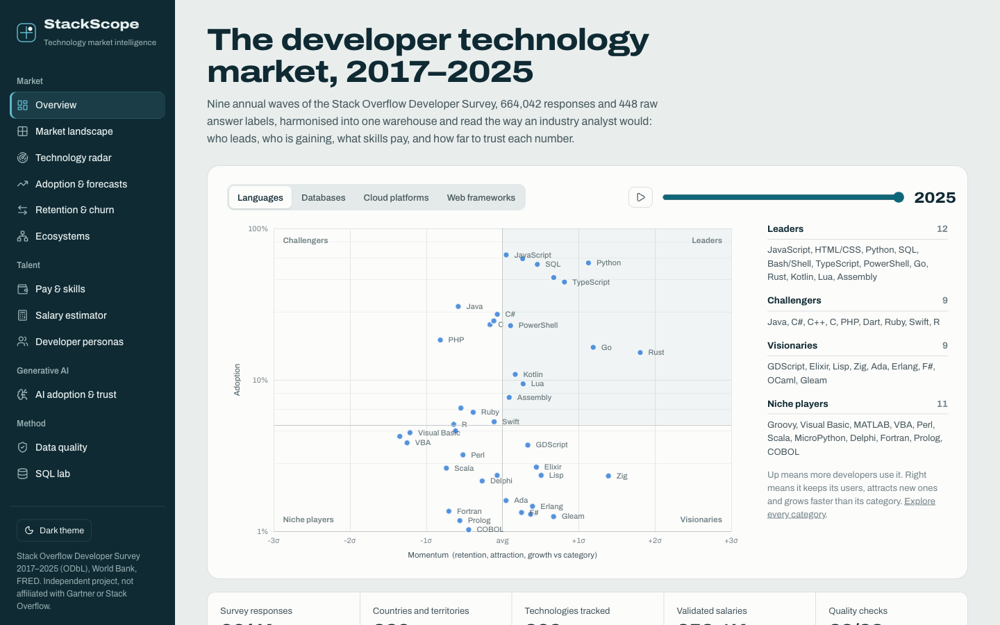
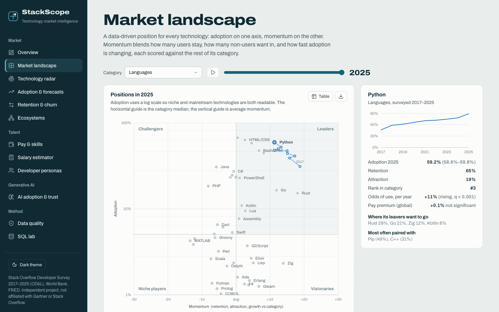
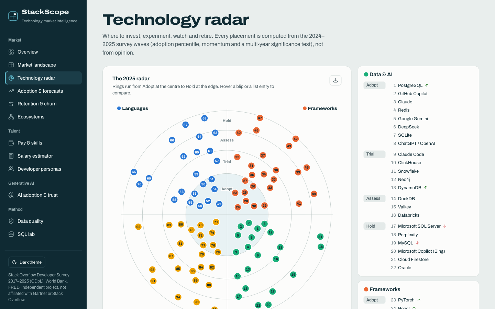
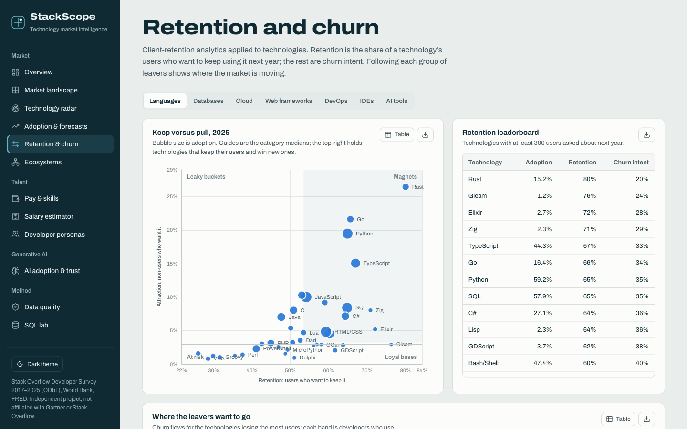
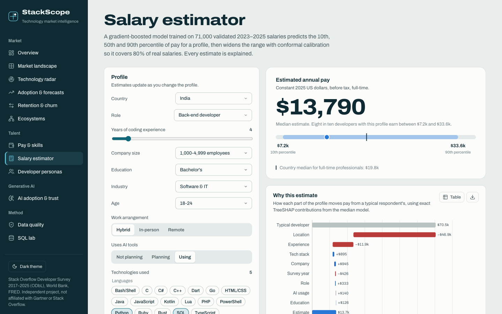
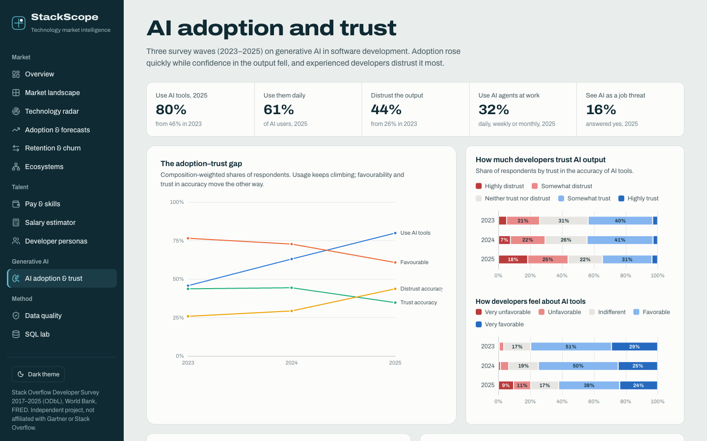
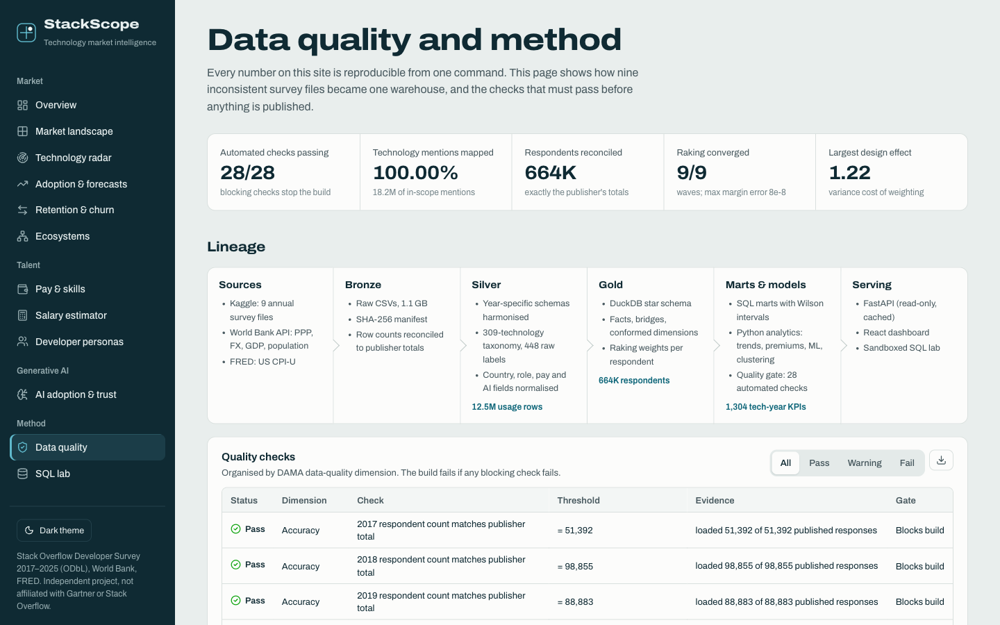
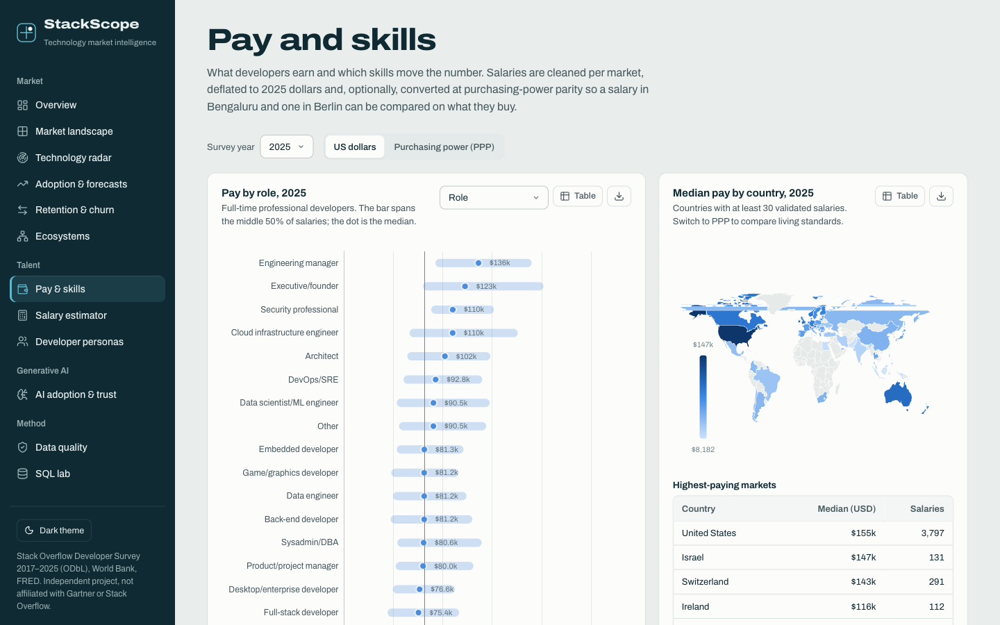
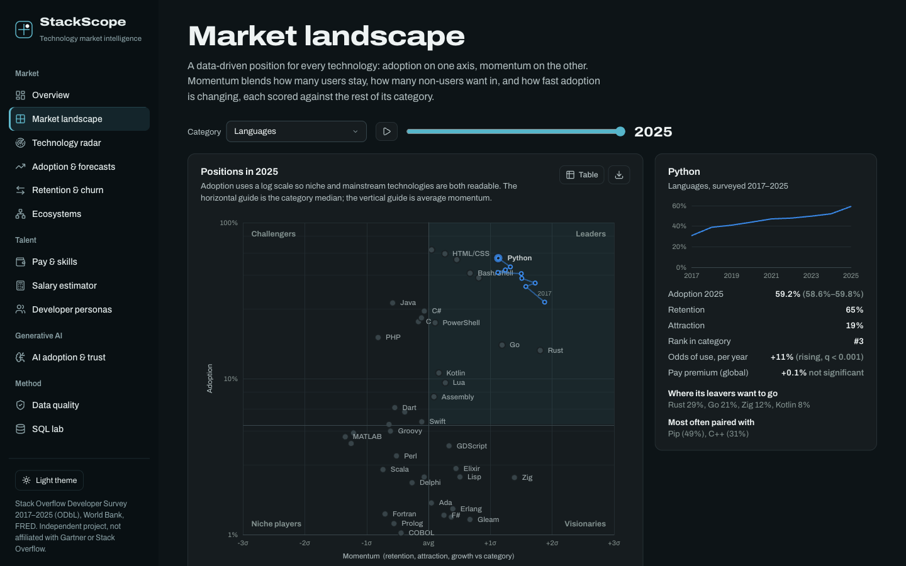
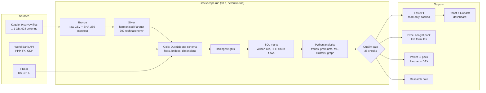

# StackScope

**Technology market intelligence from 664,042 developer survey responses (2017–2025).**

StackScope turns nine inconsistent annual releases of the Stack Overflow Developer Survey into one reproducible analytics
warehouse, then reads it the way an industry analyst would. It shows which technologies lead and which are losing
momentum, where developers are migrating, what skills are worth after controlling for everything else, and how far to
trust each number. The warehouse is DuckDB (a star schema), the analytics are Python, the API is FastAPI and the dashboard
is React with ECharts. Everything, from raw download to the Excel pack, rebuilds with one command.



> Independent portfolio project. Not affiliated with Gartner or Stack Overflow. "Magic Quadrant" is a Gartner trademark;
> the quadrant here is an original, data-driven method that only borrows the idea of a two-axis market view.

---

## What the data says

Every figure below is computed by the pipeline. The dashboard and the [research note](reports/research_note.md) render
them from the warehouse, so they cannot drift from the data.

- **GenAI adoption reached 80% while trust turned negative.** Use of AI tools rose from 46% (2023) to 80% (2025), while
  the share who distrust AI output grew from 26% to 44%.
- **Experience, not age, drives AI scepticism.** Holding age, role, region and company size constant, developers with 21+
  years of coding have 0.59× the odds of trusting AI output compared with those with 6–10 years (95% CI 0.54–0.66).
- **Rust is the fastest-rising established language.** Its odds of use grew 34% a year (95% CI 26–42%): from 1.1% of
  developers in 2017 to 15.2% in 2025, with 80% of users wanting to keep it.
- **PostgreSQL overtook MySQL in 2023** and leads 57% to 43% in 2025. It is also the top destination for developers
  leaving MySQL.
- **51% of Java users don't want to keep using it next year.** Rust is their first choice (26% of leavers).
- **AWS carries the largest broad-based pay premium, +6.8%**, after controlling for country, experience, role, company
  size, education and industry. The raw gap is +27%. In India the strongest premium is Go (+14%).
- **Cloud mindshare is fragmenting.** The Herfindahl index fell from 2,286 to 1,466 between 2018 and 2025.
- **Real developer pay rose 27% since 2017** once the country mix is held fixed; the raw median suggests only 15%.
- **Adoption moves like a random walk.** Five forecasting models were backtested and none beat "same as last year", so
  projections are shown as calibrated ranges rather than trend lines.

## What's inside

| View | What it answers | Methods |
|---|---|---|
| Overview | The market at a glance; the headline findings | animated quadrant, generated findings |
| Market landscape | Who leads, challenges, innovates or is niche, in 9 categories | momentum z-scores, HHI, CR3, mindshare |
| Technology radar | Adopt, trial, assess or hold | rule-based rings, multi-year significance tests |
| Adoption & forecasts | Real trends vs noise; what 2026–27 may look like | Wilson intervals, raking, BH-FDR, weighted logistic trends, backtested forecasts |
| Retention & churn | Who keeps its users and where the leavers go | retention/attraction segmentation, churn-flow Sankey, net migration |
| Ecosystems | Which technologies travel together | co-usage lift, NPMI, Louvain communities, betweenness, association rules |
| Pay & skills | What developers earn; what skills are worth | robust outlier screening, CPI and PPP normalisation, OLS skill premiums (HC1, FDR) |
| Salary estimator | A calibrated pay range for any profile, explained | LightGBM quantile regression, conformal calibration, TreeSHAP |
| Developer personas | Segments by actual stack, not job title | TF-IDF, SVD, spherical k-means, silhouette, UMAP |
| AI adoption & trust | Who adopts, who trusts, and why | weighted Likert analysis, logistic regression odds ratios |
| Data quality | Can the numbers be trusted? | 28 automated checks (DAMA dimensions), lineage, completeness matrix |
| SQL lab | Query the warehouse directly | sandboxed read-only DuckDB, 10 showcase queries |

<table>
<tr><td></td><td></td></tr>
<tr><td></td><td></td></tr>
<tr><td></td><td></td></tr>
<tr><td></td><td></td></tr>
</table>

## Architecture



## Why this dataset is hard

The survey is published as nine unrelated files, and the pipeline has to reconcile all of them:
- Column names change every year.
- Options are renamed, split, merged and moved between questions. Node.js was a framework, then "misc tech", then a
  language, then a web framework.
- Multi-select answers are stored as delimited strings.
- Currencies, caps and top-coding differ by year.
- Publisher defects exist, such as two swapped AI columns in 2023.
- The respondent mix shifts from wave to wave.

The pipeline handles all of this explicitly. See [docs/methodology.md](docs/methodology.md) for every decision.

## Run it

Requirements: Python 3.11+, [uv](https://docs.astral.sh/uv/), Node 22+ and a free Kaggle API token.

```bash
cp .env.example .env          # add your KAGGLE_API_TOKEN
make setup                    # Python env + web dependencies
make pipeline                 # download, harmonise, build warehouse, analytics, quality gate, reports (~2 min)
make serve                    # dashboard + API on http://localhost:8000
```

Development: run `make api` and `make web-dev` (hot reload on :5173). Other targets are `make test`, `make lint`,
`make notebook` and `make docker-build && make docker-up`.

## Deliverables

- **Dashboard:** 12 views with light and dark themes. Every chart has a data-table view and a CSV export.
- **`reports/StackScope_Analyst_Pack.xlsx`:** a live Excel workbook. Its dashboard and summary are formulas (INDEX/MATCH,
  CHOOSE, COUNTIFS, AVERAGEIFS, MAXIFS) with data validation, conditional formatting, a chart and a PivotTable-ready sheet.
- **`reports/research_note.md`:** a written brief with findings, recommendations, methodology and limitations.
- **`reports/bi/`:** the star schema as Parquet, plus `measures.dax` and `model.md` for Power BI or Tableau.
- **`notebooks/01_analysis_walkthrough.ipynb`:** an executed walkthrough of the key analytical decisions.
- **`docs/data_dictionary.md`:** generated from the live warehouse catalog.

## Project structure

```
config/                 source registry, 309-technology taxonomy
src/stackscope/
  ingest/               Kaggle download with provenance, World Bank + FRED clients
  harmonize/            per-year schemas, value parsers, taxonomy, countries, silver builder
  warehouse/sql/        core star schema + marts (versioned SQL)
  analytics/            weighting, stats, trends, landscape, forecast, premiums, salary model, personas, network, GenAI
  quality/              data-quality gate
  reporting/            Excel pack, research note, BI export, data dictionary
  api/                  FastAPI app (routers per domain, sandboxed SQL lab)
  cli.py                pipeline orchestrator
web/src/                React + TypeScript dashboard (pages, chart builders, design tokens)
tests/                  99 tests: parsers, taxonomy, statistics, raking, conformal coverage, SQL sandbox, API, warehouse
notebooks/  docs/  reports/
```

## Quality and reproducibility

- **Source reconciliation.** The row count for every wave matches the publisher's published total.
- **Quality gate.** 28 automated checks; a failing blocking check stops the build.
- **Determinism.** Seeded, ordered and deterministic LightGBM, so two consecutive runs produce identical outputs
  (verified by table fingerprints).
- **Tests and CI.** 99 tests plus lint and a type-checked frontend build, all run in GitHub Actions.
- **Secrets.** The Kaggle token lives in `.env` (git-ignored). The container image only ever receives the built warehouse.

## Limitations

Survey respondents self-select, so weighting corrects composition drift between waves but not selection into the survey.
Mindshare is developer usage, not vendor revenue. Pay premiums are associations, not causal effects. Known questionnaire
breaks are flagged wherever they affect a comparison.

## Data and licences

Stack Overflow Developer Survey 2017–2025 ([ODbL](https://opendatacommons.org/licenses/odbl/)), World Bank World
Development Indicators (CC BY 4.0) and FRED CPI-U (public domain). Code: MIT.
